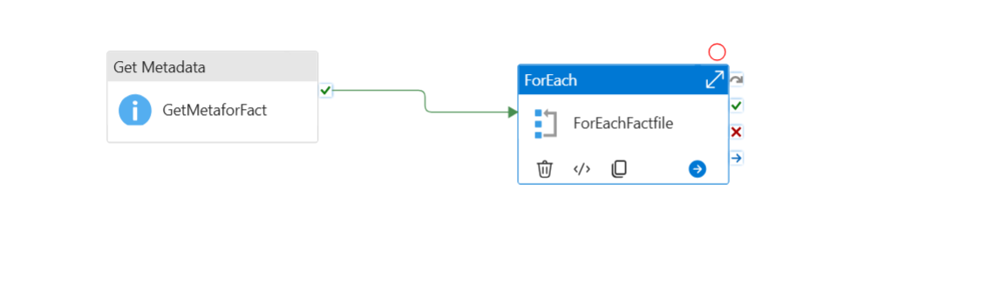
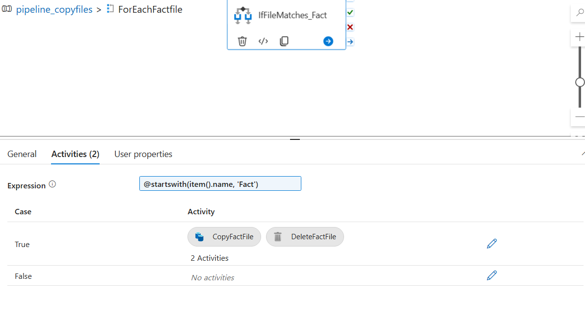
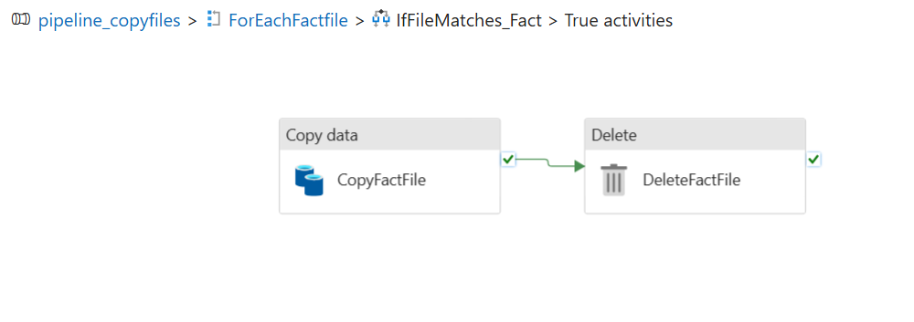
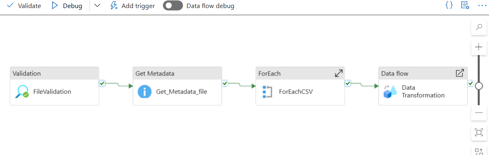
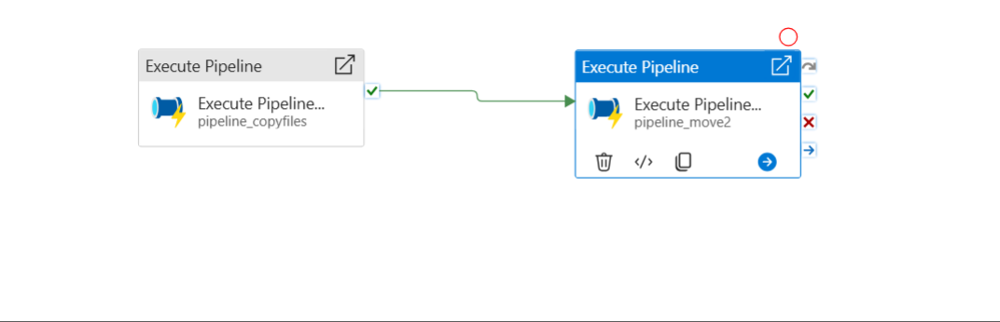

# Sales data ETL Pipelines – Azure Data Factory

This learning project demonstrates **two approaches (batch and per-file)** to build an **end-to-end ETL pipeline** in Azure Data Factory (ADF).  
The pipelines automate **file ingestion, filtering, transformation, and output generation** from Azure Data Lake folders using **dynamic parameterization and Mapping Data Flows**.

## **Project Objective**
- Automate ingestion of CSV files from **Folder A (source)**.
- Filter only files starting with **`fact`**.
- Copy them to **Folder B (reporting)**.
- Apply **data cleaning and transformations** using Mapping Data Flows.
- Output cleaned data as **CSV files** (either single combined output or one file per input).

# Pipeline 1: Batch Processing**
### **Overview**
- All files starting with fact are copied from source folder to destination folder.
- Files are deleted from the source folder after copying.
- Files are processed as a batch from the destination folder, transformed, and written to a reporting folder.
- A single Mapping Data Flow processes all files together.
- Output is written as one combined file (part-0000...).

  Pipeline execution -> 

### **Pipeline Flow with Screenshots**
1. **Get Metadata:** List all files in Folder 'source' (`childItems`). --  
2. **ForEach:** Iterate over each file name.
3. **If Condition:** `@startswith(item().name, 'fact')`. -- 
4. **Copy Data:** Copy valid files to Folder 'destination' with `@item().name`.
5. **Delete files** Delete the files from source folder after successful copy. -- 
6. **Get Metadata** (Destination): List all files in destination folder. 
7. **Data Flow:** Process all files together with transformations -- 
    (Select, Filter, Conditional Split, Derived Column, Aggregate). 
8. **Sink:** Write a cleaned output file to reporting folder (part-0000... file). 

### **Dynamic Parameterization**
- Data Flow parameter: `fileName`.
- Dataset input: `@dataset().p_filename`.

# **Pipeline 2: Per-File Processing**
### **Overview**
- Each file starting with fact is processed individually.
- Files are first copied to a reporting folder.
- After copying, each file is cleaned and transformed (Select, Filter, Derived Column, Aggregation) and saved to a cleaned_output folder.
- Each file’s name is dynamically parameterized and renamed (e.g., fact_sales_cleaned.csv).

  Pipeline execution -> 

### **Pipeline Flow with Screenshots**
1. **Get Metadata**: List all files in the source folder. -- 
    
2. **ForEach**: Iterate over each file.
3. **If Condition**: @startswith(item().name, 'fact'). -- 
4. **Copy Data**: Copy the file to reporting folder (@item().name). -- 
5. **Data Flow** (inside ForEach): -- 
6. Transform the file dynamically using item().name. --  
7. Apply transformations (Select, Filter, Derived Column, Aggregate). -- 
8. **Sink**: Write the cleaned file into the cleaned_output folder with a name like replace(item().name, '.csv', '_cleaned.csv').
    
    

### **Advantages**
- Each file is cleaned independently, making debugging easier.
- No part-000 files – each input maps to one cleaned output.
- Fully parameterized (datasets, file names, and Data Flow).

### **Triggers**
- **Event Trigger (Initial Approach):** Fired per file → caused duplicates.
- **Ready.txt Batch Trigger:** Runs once when all files + `ready.txt` are uploaded.

### **Learnings**
- Dynamic content (`@item().name`, `@pipeline().parameters.paramName`).
- Batch vs per-file pipeline design.
- Parameterized Data Flows for reusability.
- Trigger strategies (event vs batch).

